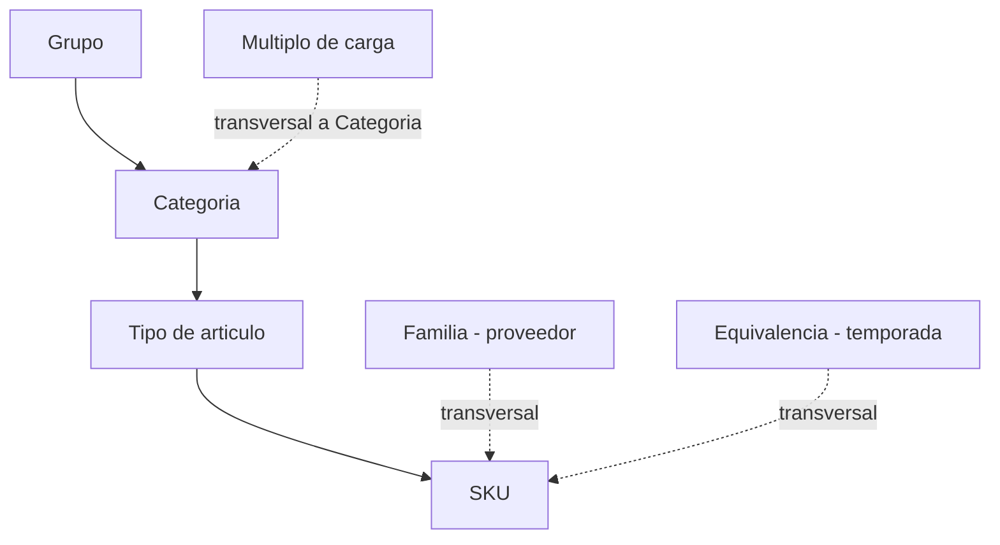
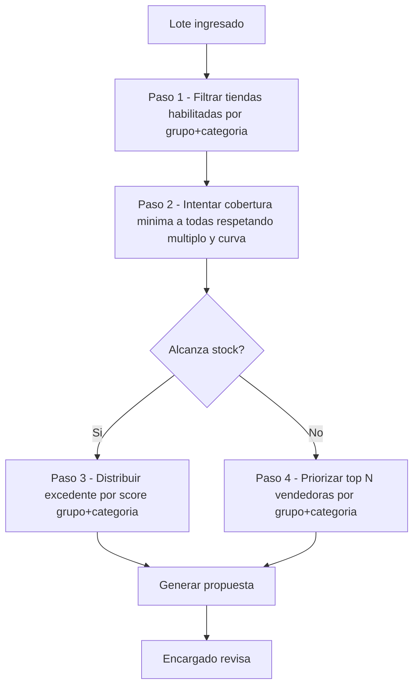
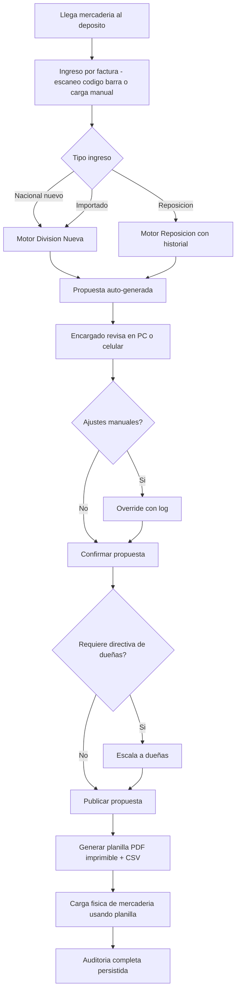
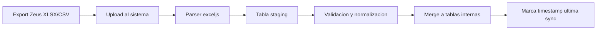

# PRD 2.0 - Division y Reposicion

Fecha: 2026-04-22
Version: **2.0** (reemplaza v1.0 del 2026-04-22)
Estado: Borrador post-Sesion 1 (interrogacion socratica)
Autores: Equipo producto Casamoda + representante dueñas
Proyecto padre: Casamoda App (modulo transversal a Importacion, Compras, Finanzas, RRHH)

> Referencias cruzadas:
> - [NOTAS_PROYECTO_DIVISION.md](NOTAS_PROYECTO_DIVISION.md) (notas crudas iniciales)
> - [DECISIONES_DUENAS.md](DECISIONES_DUENAS.md) (bitacora de decisiones con citas literales)
> - [CLAUDE.md](CLAUDE.md) (convenciones tecnicas del proyecto)

---

## Changelog v1.0 -> v2.0

| Area | v1.0 | v2.0 |
|------|------|------|
| Roles operativos | 3 roles separados (deposito, admin reposicion, admin oficina) | **1 encargado unico** que opera todos los flujos |
| Motor | MyMax como formula central | MyMax complementa, el **nucleo es cobertura minima + ranking por grupo+categoria** |
| Ranking | Score global por tienda | **Ranking por grupo+categoria+tienda** (caso 36 labiales lo fuerza) |
| Tiendas | 12 tiendas genericas | **16 tiendas** con tier A/B/C y matriz explicita de bloqueos |
| Luro | Tienda mas entre 16 | **Outlet separado** (remanentes/liquidacion, flujo aparte) |
| Multiplos | No contemplados | **Regla dura**: no se rompen docenas/unidades de carga |
| Retencion deposito | No explicita | **Regla valida**: dejar stock en deposito es decision correcta |
| Motor alertas (IA) | Mencion vaga Fase 3 | **Roadmap Fase 4 concreto**: quiebre, sobrestock, reposicion |
| Piloto | Un despliegue completo | **Piloto escalado**: por categoria -> por ingreso -> unificacion total |
| Dueñas | Aprobadoras por flujo | **Directivas duras esporadicas**, no operativas diarias |
| Zeus | Integracion por API | **Sin API por ahora**: ingesta por export manual XLSX/CSV |
| UX | PC oficina | **Mobile + PC**, encargado opera desde cualquier lado |

---

## 1) Vision de producto

Una sola aplicacion (web + mobile) para que **un unico encargado** pueda ejecutar los tres flujos que hoy estan en planillas Excel separadas y operados por tres personas:

- Division **nacional nueva** (fabricacion).
- Division **importado**.
- **Reposicion** nacional.

El sistema sugiere una distribucion optima por tienda respetando reglas comerciales, de talle, bloqueos y multiplos de carga; el encargado ajusta si hace falta; se imprime la planilla fisica para cargar mercaderia y queda todo auditado.

**Criterio de exito global**: el encargado se siente comodo reemplazando Excel (criterio cualitativo, sin plazo fijo).

**Principios rectores**:

1. **MVP First**: motor minimo que resuelve el 80% de los casos, el resto se ajusta manual.
2. **Mobile-first donde importa**: ingreso/consulta por celular; edicion pesada por PC.
3. **Excel paralelo durante piloto**: el sistema no reemplaza Excel hasta validacion operativa.
4. **Reglas duras > heuristicas**: los minimos, multiplos, curvas y bloqueos no se negocian. El motor nunca los rompe.
5. **Directivas de dueñas son ley**: cuando existen, se imponen sobre el motor (con log).

---

## 2) Glosario canonico

| Termino | Definicion |
|---------|------------|
| **Grupo** | Segmentacion mas amplia del catalogo (ej. Indumentaria, Cosmetica, Hogar). |
| **Categoria** | Subdivision dentro del grupo (ej. Ropa Dama, Ropa Niños, Labial, Esmalte). |
| **Tipo de articulo** | Agrupacion de SKUs que comparten forma (ej. "remera manga corta"). |
| **SKU** | Codigo unico terminal (ej. "remera manga corta blanca talle L"). |
| **Familia** | Proveedor que lo fabrica/importa. Atributo transversal a la jerarquia. |
| **Equivalencia** | Temporalidad: `verano`, `alto verano`, `invierno`, `alto invierno`. Atributo transversal. |
| **Curva completa** | Todos los talles definidos disponibles en al menos un color. |
| **Multiplo** | Unidad minima de despacho por categoria (ej. labiales = docena/12). |
| **MyMax** | Tope logico por `categoria x tienda` para no sobrestockear. |
| **Tier** | Categoria comercial de tienda: A (fuerte), B (media), C (debil). |
| **Ranking por grupo+categoria** | Score de ventas de una tienda SOLO para esa combinacion (no global). |
| **Bloqueo** | Regla dura que impide asignar `categoria -> tienda`. |
| **Outlet / Luro** | Flujo aparte. Luro recibe remanentes de liquidacion/descarte, no participa de division normal. |
| **Marciano** | Producto/proveedor especial (convencion heredada, ver modulos futuros). |
| **Directiva de dueñas** | Override manual vinculante de cualquier regla, con log obligatorio. |
| **Lote / Ingreso** | Mercaderia recibida por factura. Unidad atomica del motor de division. |

---

## 3) Taxonomia y catalogo

### 3.1 Jerarquia



### 3.2 Atributos por nivel

- **Grupo**: nombre, codigo, activo.
- **Categoria**: nombre, grupo padre, multiplo por defecto, MyMax base, bloqueos por defecto.
- **Tipo de articulo**: nombre, categoria padre, flag `tieneTalle`, curva default.
- **SKU**: codigo Zeus, descripcion, tipo de articulo, color, talle, familia, equivalencia, precio, costo, estado.

### 3.3 Fuente

- Catalogo completo vive en **Zeus**.
- **Sin API por ahora**: ingesta al sistema via export manual XLSX/CSV.
- El sistema mantiene espejo local con marca `ultimaSincronizacion` y detecta diffs entre exports consecutivos.

---

## 4) Mapa de tiendas (16) con tier y bloqueos

### 4.1 Listado completo con tier

| Tier | Tiendas |
|------|---------|
| **A** (fuerte) | Balcarce, Rivadavia, Larrea, Madariaga, Independencia, Peralta Ramos |
| **B** (media) | Tres Arroyos, Ayacucho, Suarez, Miramar, Luro, Necochea |
| **C** (debil) | Pigue, San Juan, Rauch, Tandil |

> Luro figura en tier B por volumen, pero **opera como outlet**: recibe flujo distinto (ver 4.3).

### 4.2 Matriz de bloqueos explicita

| Tienda | Ropa Dama | Ropa Hombre | Ropa Niños | Capacidad |
|--------|-----------|-------------|------------|-----------|
| Balcarce | OK | OK | OK | normal |
| Rivadavia | OK | OK | **BLOQ** | normal |
| Larrea | OK | OK | OK | normal |
| Madariaga | OK | OK | OK | normal |
| Independencia | OK | OK | OK | normal |
| Peralta Ramos | OK | OK | OK | normal |
| Tres Arroyos | OK | OK | OK | normal |
| Ayacucho | OK | OK | OK | normal |
| Suarez | OK | OK | OK | normal |
| Miramar | OK | OK | OK | normal |
| Luro | **outlet** | **outlet** | **outlet** | outlet |
| Necochea | OK | OK | OK | normal |
| Pigue | OK | OK | **BLOQ** | normal |
| San Juan | **BLOQ** | **BLOQ** | **BLOQ** | normal |
| Rauch | **BLOQ** | **BLOQ** | **BLOQ** | normal |
| Tandil | OK | OK | **BLOQ** | **limitada** (espacio fisico reducido) |

### 4.3 Luro como outlet (flujo aparte)

Luro no participa en division normal. Recibe:

- Remanentes de liquidacion desde deposito.
- Producto dormido de otras tiendas (disparado por alerta sobrestock, ver seccion 15).
- Saldos de temporada vencida (ver Equivalencia).

El modulo Outlet es **separado** del motor de division; comparte datos de catalogo y stock pero tiene pantallas y reglas propias.

### 4.4 Tienda tier C con capacidad limitada

Tandil tiene capacidad fisica reducida. El motor debe respetar un `maxCapacidadCategoria` especifico por tienda que puede ser menor al MyMax calculado.

---

## 5) Reglas del motor de division (nucleo)

### 5.1 Inputs por lote

Cuando ingresa un lote (factura):

```
{
  lotId,
  fechaIngreso,
  origen: NACIONAL | IMPORTADO,
  tipo: NUEVA | REPOSICION,
  lineas: [
    {
      sku,
      cantidad,
      grupo,
      categoria,
      tipoArticulo,
      multiplo,         // ej 12 para labiales
      tieneTalle,       // true/false
      coloresTalles,    // estructura de curva si aplica
      equivalencia      // temporada
    }
  ]
}
```

### 5.2 Outputs esperados

```
{
  proposalId,
  lotId,
  allocations: [ { storeId, sku, cantidadSugerida, score, flags } ],
  remanenteDeposito: { sku -> cantidad },
  alertas: [ ... ],
  estado: BORRADOR | VALIDADA | REQUIERE_EXCEPCION
}
```

### 5.3 Algoritmo de 4 pasos



**Paso 1 - Filtrado**:
- Excluir tiendas con bloqueo activo para ese `grupo+categoria`.
- Excluir Luro (flujo outlet aparte).
- Ajustar capacidad (Tandil u otras limitadas).

**Paso 2 - Cobertura minima**:
- Calcular `minimoAjustadoTienda = ceil(minimoBaseProducto * factorTienda)`
  - factorTienda: A=1.00, B=0.85, C=0.70
- Intentar enviar `minimoAjustadoTienda` a todas las habilitadas.
- Respetar **multiplo de categoria**: toda asignacion debe ser multiplo del multiplo de carga (ej. 12 labiales o multiplos de 12).
- Respetar **curva completa**: para productos con talle, enviar solo si al menos un color tiene curva completa.

**Paso 3 - Excedente**:
- Si sobra stock tras cubrir minimos, asignar a tiendas con mayor score.
- **Score es por `grupo+categoria+tienda`** (no global):
  - `score = (sellThrough90d * 0.5) + (rotacionCategoria60d * 0.3) + (quiebreBajo30d * 0.2)`
  - Calculado solo con ventas de esa grupo+categoria en esa tienda.
- Respetar MyMax y maximo producto/tienda en todo momento.

**Paso 4 - Stock insuficiente (caso trampa)**:
- Si `cantidadDisponible / multiplo < tiendasHabilitadas`, **no se fuerza cobertura total**.
- Se priorizan top N vendedoras de esa `grupo+categoria` y se les manda 1 multiplo completo cada una.
- Caso de ejemplo: 36 labiales, 15 tiendas habilitadas, multiplo 12. Resultado: **3 tiendas top con 12 cada una**, resto cero.

### 5.4 Reglas duras (nunca se violan automaticamente)

1. **No romper multiplo**: jamas enviar 3 labiales si el multiplo es 12.
2. **Curva completa**: no enviar producto con talle si no hay curva completa en al menos un color (pasa a `REQUIERE_EXCEPCION`).
3. **Bloqueos por tienda**: no asignar a tiendas bloqueadas para esa categoria.
4. **MyMax**: no sobrepasar el tope por categoria/tienda.
5. **Maximo producto/tienda**: no sobrepasar el tope por SKU/tienda.
6. **Capacidad fisica**: respetar tope de tiendas como Tandil.

Solo pueden violarse con **directiva manual explicita** (con log, ver seccion 10).

### 5.5 Directivas de dueñas

- Las dueñas pueden intervenir con directivas: "a esta tienda mandale mas", "no mandes nada de esta categoria este mes", "priorizar Balcarce".
- Son esporadicas (no operativas diarias) pero **vinculantes**.
- Se ingresan al sistema como `OwnerDirective` con vigencia y alcance (categoria, grupo, tienda, sku).
- Tienen prioridad sobre cualquier regla del motor.
- Todo override queda auditado.

---

## 6) Retencion en deposito

Dejar mercaderia en deposito es una **decision operativa valida**, no una falla del motor.

Casos normales de retencion:

- **Fraccion menor a un multiplo**: si sobra stock que no alcanza multiplo, se retiene en deposito (o se suma a la tienda top 1 si conviene).
- **Espera de señal de venta**: piloto de producto en pocas tiendas antes de rollout.
- **Prevencion de sobrestock**: mejor esperar que saturar.
- **Directiva de dueñas**: retener por decision comercial.

El motor muestra `remanenteDeposito` explicito en cada propuesta y el encargado puede ajustar.

---

## 7) Flujo E2E operativo



### 7.1 SLA operativo

- **Tiempo objetivo**: 10 dias desde ingreso hasta distribucion final.
- **Volumen normal**: ~2 ingresos/dia.
- **Picos**: hasta 1 semana completa con ingresos diarios.
- **Generacion de propuesta**: < 10 minutos tras ingreso.
- **Publicacion**: inmediata al confirmar.

### 7.2 Canales

- Encargado opera desde **PC de oficina** (edicion pesada) o **celular** (consulta, aprobacion rapida, escaneo codigo barra).
- Planillas finales se imprimen en papel (hoy se imprimen y se usan fisicamente para cargar).
- El sistema **no genera bultos**, solo planillas de carga.

---

## 8) Roles y permisos

### 8.1 Modelo simplificado (cambio clave vs v1.0)

| Rol | Funcion | Actual v1.0 | Futuro v2.0 |
|-----|---------|-------------|-------------|
| Encargado unico | Opera importado, nacional nuevo, reposicion | 3 personas distintas | **1 sola persona** |
| Dueñas | Directivas esporadicas, supervision | Aprobadoras habituales | **Directivas duras cuando corresponde** |
| Admin sistema | Parametros, catalogo, bloqueos | No existe formal | Rol tecnico nuevo |

### 8.2 Permisos

- **Encargado**: generar, editar, confirmar y publicar propuestas. Override con log.
- **Dueñas**: ingresar directivas, ver auditoria, aprobar excepciones criticas.
- **Admin**: mantenimiento de catalogo, bloqueos, tiers, multiplos. No opera flujo diario.

### 8.3 Auditoria obligatoria

Cada accion queda registrada: quien, cuando, que cambio, motivo. Ver `AuditEvent` en modelo de datos.

---

## 9) Modelo de datos funcional

### 9.1 Entidades clave

- **Product** (sku, tipoArticulo, categoria, grupo, familia, equivalencia, tieneTalle, multiploDefault)
- **Store** (storeId, nombre, tier, factorTienda, capacidadMaxPorCategoria, esOutlet)
- **StoreBlockingRule** (storeId, grupo?, categoria?, estado HABILITADO/BLOQUEADO, motivo, vigencia)
- **StockIngressLot** (lotId, factura, fechaIngreso, origen, tipo NUEVA/REPOSICION, creadoPor)
- **LotLine** (lotId, sku, cantidad, multiplo)
- **DivisionProposal** (proposalId, lotId, estado, resumenValidaciones, generadoPor)
- **AllocationLine** (proposalId, productId, storeId, cantidadSugerida, cantidadAprobada, score, flags)
- **SalesScore** (storeId, grupo, categoria, sellThrough90d, rotacion60d, quiebre30d, scoreCalculado, actualizado)
- **OwnerDirective** (directiveId, alcance, valor, vigenciaDesde, vigenciaHasta, emisor, motivo)
- **AuditEvent** (eventId, proposalId?, tipoEvento, payloadJson, actor, timestamp)
- **Alert** (alertId, tipo QUIEBRE/SOBRESTOCK/REPOSICION, storeId?, categoria?, sku?, severidad, estado)

### 9.2 Relaciones clave para el motor

- `SalesScore` indexado por `(storeId, grupo, categoria)` -> ranking rapido en Paso 3 y Paso 4.
- `StoreBlockingRule` con fallback por categoria -> grupo -> global.
- `OwnerDirective` con prioridad sobre cualquier calculo (se evalua antes del algoritmo).

### 9.3 Preparacion para Prisma

El schema definitivo se define al iniciar implementacion. Esta seccion es guia funcional, no SQL.

---

## 10) Fuentes de datos e integracion

### 10.1 Realidad actual: Zeus sin API

No hay acceso por API a Zeus todavia. La informacion se obtiene por **exports manuales XLSX/CSV**:

- Catalogo de productos.
- Stock por tienda y deposito.
- Ventas historicas por tienda/categoria/producto.
- Ingresos (facturas de compra).

### 10.2 Pipeline de ingesta



### 10.3 Diseñado para migrar a API

Las tablas internas abstraen la fuente. Cuando Zeus habilite API, se reemplaza el parser de exports por cliente HTTP sin tocar el resto.

### 10.4 Datos derivados propios

El sistema tambien genera y persiste datos que Zeus no expone:

- Propuestas de division (historial completo).
- Directivas de dueñas.
- Overrides y motivos.
- Alertas disparadas.
- Parametros MyMax, multiplos, bloqueos.

---

## 11) UX / UI

### 11.1 Principios

- **Minimalista pero denso en informacion**: tablas limpias con muchos datos utiles, no dashboards con huecos.
- **Tono cercano**: el encargado tiene que sentir que es una herramienta suya, no un ERP rigido.
- **Mobile-first en consulta y aprobacion rapida**. PC para edicion pesada.
- **Dark/light mode** (convencion Casamoda App).

### 11.2 Pantallas principales

1. **Ingreso de lote**: escaneo de codigo barra + formulario. Mobile y PC.
2. **Propuesta de division**: tabla por SKU x tienda con cantidades sugeridas, score, flags. Editable inline.
3. **Detalle de producto**: curva de talles, historial de venta por tienda, bloqueos aplicables.
4. **Matriz de bloqueos**: vista global editable (admin only).
5. **Directivas de dueñas**: formulario simple, vigencia y alcance.
6. **Alertas** (Fase 4): bandeja priorizada por severidad.
7. **Auditoria**: timeline por propuesta con todos los eventos.

### 11.3 Exportaciones

- **PDF imprimible** (planilla fisica para cargar mercaderia, reemplaza el Excel actual).
- **CSV** para cruces con Zeus si hace falta.
- **Excel espejo** durante piloto para que el encargado compare con sus planillas de siempre.

### 11.4 Modo piloto "Excel paralelo"

Durante las fases de piloto, el sistema expone la propuesta **tambien en formato Excel identico al actual**, para que el encargado pueda:

- Comparar resultado del motor con lo que el habria hecho.
- Usar el Excel si no se siente seguro, pero registrar la comparacion.
- Ir ganando confianza hasta abandonar Excel.

---

## 12) Roadmap de implementacion (piloto escalado)

Plazos cualitativos: **cada fase dura "hasta que el encargado este comodo"**. Sin fechas fijas.

### Fase 0 - Fundacion

Objetivo: infraestructura y datos listos.

- Scaffolding Next.js + NestJS + Prisma + PostgreSQL.
- Ingesta Zeus (parser XLSX).
- Carga inicial de catalogo, 16 tiendas, multiplos por categoria, matriz de bloqueos, tiers.
- Autenticacion (encargado, dueñas, admin).
- Sin motor aun: solo visualizacion de catalogo y stock.

### Fase 1 - Piloto A: por categoria

Objetivo: probar motor en un universo reducido y controlado.

- Elegir **1 categoria piloto** (sugerido: cosmetica con multiplo claro, bajo riesgo).
- Motor completo para esa categoria: 4 pasos del algoritmo, reglas duras, MyMax, ranking grupo+categoria.
- Flujo completo ingreso -> propuesta -> revision -> publicacion -> planilla PDF.
- Modo Excel paralelo activo.

Criterio de salida: encargado confia en el motor para esa categoria.

### Fase 2 - Piloto B: por tipo de ingreso

Objetivo: probar motor en un flujo completo end-to-end, separado del otro.

- Elegir **1 tipo de ingreso piloto** (sugerido: importado, el mas estructurado).
- Motor para todos los productos de ese tipo, todas las categorias.
- Correr **en paralelo** al Piloto A (se testean casos por dos ejes distintos).

Criterio de salida: encargado confia en el motor para ese tipo de ingreso.

### Fase 3 - Unificacion total

Objetivo: reemplazar los 3 Excel.

- Motor para: importado + nacional nuevo + reposicion.
- Todas las categorias y todos los tipos de ingreso.
- Excel paralelo apagado gradualmente.
- Onboarding formal del encargado como usuario unico.

### Fase 4 - Motor de alertas (IA basica)

Ver seccion 13.

### Fase 5 - Modulos futuros

Ver seccion 14.

---

## 13) Roadmap IA / Motor de alertas

Seccion nueva en v2.0. Objetivo: que el sistema no solo divida sino que **proponga acciones proactivas** de gestion de stock.

### 13.1 Alerta quiebre

- **Trigger**: tienda habilitada tiene stock cero (o bajo umbral) en SKU que deberia tener.
- **Sugerencia**: reposicion desde deposito, o transferencia inter-tienda si no hay stock central.
- **Severidad**: segun rotacion del SKU en esa tienda.

### 13.2 Alerta sobrestock

- **Trigger**: SKU con baja rotacion y cobertura excesiva en una tienda (producto dormido).
- **Sugerencia**:
  1. Si otra tienda lo rota mejor, transferencia.
  2. Si ninguna lo rota, pasar a **rebaja / outlet / Luro**.
- **Severidad**: segun dias de cobertura sobre objetivo.

### 13.3 Alerta reposicion

- **Trigger**: tienda cayo bajo umbral minimo de cobertura por categoria (ej. Ropa Dama < 7 dias).
- **Sugerencia**: abrir propuesta de reposicion automatica para esa tienda+categoria.

### 13.4 Sugerencias proactivas del motor

Post-division, el motor puede sugerir:

- "Este lote conviene retener 30% en deposito, alertas de quiebre previstas en 2 semanas."
- "Esta categoria tiene sobrestock global, considerar no recibir mas del proveedor este mes."

### 13.5 Prioridad entre alertas

Pendiente de definir con dueñas (ver seccion 18). Hipotesis inicial: quiebre > reposicion > sobrestock.

### 13.6 Capa estadistica avanzada (sin romper motor actual)

Objetivo: evolucionar el sistema desde reglas + score historico hacia una version asistida por modelos, manteniendo las reglas duras del negocio.

Principios:

- El motor actual (multiplo, curva, bloqueos, MyMax, capacidad, directivas) sigue siendo el validador final.
- Los modelos estadisticos proponen prioridad y cantidades objetivo; nunca violan reglas duras.
- Si el modelo falla o no tiene datos suficientes, se usa fallback al motor actual deterministico.

Capas propuestas:

1. **Forecast demanda SKU+tienda (7/14/30 dias)**  
   Estimar demanda esperada por `sku + tienda` para mejorar priorizacion de asignacion.
2. **Probabilidad de quiebre y sobrestock**  
   Estimar riesgo para alimentar alertas y decisiones de retencion en deposito.
3. **Sugerencia de cobertura objetivo**  
   Recomendar dias de cobertura por categoria/tienda como input adicional al motor.

Integracion funcional:

- Nuevo campo opcional en runtime: `mlScore` por `sku+tienda`.
- Score final hibrido sugerido:
  - `scoreHibrido = (scoreReglas * alpha) + (mlScore * (1 - alpha))`
  - `alpha` configurable por fase (inicial alto para reglas, ej. 0.8).
- Modo operativo con feature flag:
  - `MODO_CLASICO` (solo reglas actuales)
  - `MODO_HIBRIDO` (reglas + capa estadistica)

Fases de adopcion:

- **Fase A (shadow mode):** modelo corre en paralelo, no impacta decisiones; se compara contra decisiones publicadas.
- **Fase B (asistido):** modelo sugiere, encargado decide; motor valida reglas.
- **Fase C (hibrido):** modelo participa en ranking final bajo guardrails y auditoria.

KPIs de validacion de esta capa:

- Reduccion de quiebres vs baseline.
- Reduccion de sobrestock vs baseline.
- Mejora en % propuestas aceptadas sin ajuste manual.
- Error de forecast (MAPE/WAPE) por categoria piloto.

---

## 14) Modulos futuros identificados

Salidos de la sesion socratica. No forman parte del MVP pero estan en el radar.

### 14.1 Merma / Descarte

Gestion de productos fallados, devoluciones, robos. Integrado con auditoria de stock.

### 14.2 Transferencia Inter-Tienda

Hoy es poco comun pero acaba de empezar. El sistema lo soporta formalmente cuando madure.

### 14.3 Equivalencia / Temporada activa

Reglas automaticas por temporada: "no mandar invierno en febrero a tiendas costa", "prioridad alto verano en diciembre".

### 14.4 Piloto de producto

Herramienta para probar producto nuevo en pocas tiendas antes de rollout, con medicion post-piloto automatica.

### 14.5 Outlet automatizado

Flujo Luro expandido con reglas propias de rebaja y liquidacion.

### 14.6 Marciano

Convencion heredada. Pendiente de definir alcance en proximas sesiones.

---

## 15) Riesgos y mitigaciones

| Riesgo | Probabilidad | Impacto | Mitigacion |
|--------|--------------|---------|------------|
| Zeus sin API -> exports manuales desfasados | Alta | Alto | Pipeline de ingesta robusto + alerta de stale data. Presionar por API. |
| Resistencia del encargado al cambio | Media | Alto | Excel paralelo hasta que este comodo. Sin plazo forzado. |
| Errores en taxonomia Zeus (REF!, vinculos rotos) | Alta | Medio | Saneamiento inicial + validacion en ingesta, no aceptar datos rotos. |
| Directivas de dueñas sin trazabilidad | Media | Medio | Log obligatorio en el sistema, formulario ad-hoc. |
| Motor propone algo absurdo | Media | Alto | Revision humana obligatoria antes de publicar. Override con log. Pendiente definir reversibilidad (ver seccion 18). |
| Un unico encargado = cuello de botella | Media | Alto | Disponibilidad mobile. Suplente definido formal. |
| MyMax mal calibrado | Media | Medio | Versionar parametros, auditar impacto semanal. |
| Cambios en multiplos/categorias no propagados | Baja | Alto | Admin con validaciones. Tests de regresion cuando exista backend. |

---

## 16) KPIs de exito

- **Adopcion**: % de ingresos procesados por el sistema (no Excel). Objetivo Fase 3: 100%.
- **Confianza en motor**: % de propuestas publicadas sin ajuste manual relevante. Objetivo Fase 3: >= 80%.
- **Tiempo de ciclo**: dias ingreso -> distribucion. Hoy ~10 dias, objetivo <= 7.
- **Cobertura de minimos**: % de combinaciones tienda+producto que cumplen minimo. Objetivo: >= 95%.
- **Reduccion de quiebres**: % de SKUs en stock cero en tiendas habilitadas. Baseline vs mes N. Objetivo Fase 4: -30%.
- **Reduccion de sobrestock**: dias de cobertura promedio por categoria. Objetivo Fase 4: -20%.
- **Excepciones por curva incompleta**: absoluto mensual. Meta: decreciente.

---

## 17) Criterios de aceptacion funcional (UAT)

Mantenidos de v1.0 + nuevos de v2.0.

1. Si una tienda esta bloqueada para una categoria, jamas recibe asignaciones de esa categoria.
2. Si producto tiene talle y no hay curva completa, propuesta queda en `REQUIERE_EXCEPCION`.
3. **Nuevo v2.0**: si `cantidad / multiplo < tiendasHabilitadas`, el motor asigna a top N vendedoras por grupo+categoria, no fracciona.
4. **Nuevo v2.0**: el motor nunca envia cantidades no-multiplo del multiplo de categoria.
5. Si stock no alcanza, se garantiza minimo completo en subset priorizado.
6. Excedente se asigna por score `grupo+categoria+tienda`, no global.
7. Reposicion con historial < 14 dias activa fallback `sin_historial`.
8. Ninguna propuesta se publica sin confirmacion del encargado.
9. **Nuevo v2.0**: directiva de dueñas activa invalida cualquier regla, con log obligatorio.
10. Publicacion genera PDF imprimible + registro auditado.
11. **Nuevo v2.0**: Luro no aparece nunca en propuestas de division normal.
12. **Nuevo v2.0**: Tandil respeta `maxCapacidadCategoria` especifico (menor que MyMax general).

---

## 18) Preguntas abiertas para proximas sesiones

Bloques que quedaron pendientes en la sesion socratica 1. Listados para agenda:

### Bloque 8 - Gobierno

- Como se documentan hoy las directivas de dueñas? (chat, reunion, mail?)
- Quien las transcribe al sistema?
- Hay veto formal de alguna duenia sobre otra? Unanimidad requerida?

### Bloque 12 - Falla / reversibilidad

- Si el motor propone algo absurdo y el encargado lo publica, como se revierte?
- Hay "modo deshacer" esperado sobre una publicacion?
- Si la mercaderia ya se cargo fisicamente, cual es el protocolo?

### Bloque 13 (profundizar) - Prioridad entre alertas IA

- Cuando hay quiebre en una tienda A y sobrestock en tienda B de la misma categoria, cual dispara primero?
- Las dueñas quieren ver todas las alertas o solo las que requieren su intervencion?

### Bloque 14 - Mas casos trampa

- Producto nuevo sin historial: como rankea tiendas? Por tier? Por score de grupo padre?
- Ingreso parcial (proveedor envia de menos): el motor recalcula o espera completar?
- Proveedor entrega un multiplo no declarado (envia 10 en vez de 12): se rechaza, se ajusta, se consulta?
- Combos / kits: 2 productos que vienen juntos por catalogo?

### Bloque 15 - Cierre global

- Definicion final de que es MVP minimo demostrable.
- Criterios objetivos (no cualitativos) para pasar de Fase 1 a Fase 2.

### Bloque taxonomia

- Confirmar lista oficial de grupos y categorias (no capturada completa en sesion 1).
- Confirmar lista de familias/proveedores activos.

### Bloque volumen y datos

- Cuantos SKUs tiene el catalogo total? (estimacion fue 5000-10000)
- Cuantos ingresos procesa el deposito por año?
- Volumen en picos (eventos, fin de temporada)?

---

## 19) Decisiones literales (referencia cruzada)

Ver [DECISIONES_DUENAS.md](DECISIONES_DUENAS.md) para la lista completa de decisiones con cita literal del representante de dueñas, organizadas por bloque socratico y fecha.

---

## 20) Anexo AS-IS: explicacion explicita por planilla y por hoja

Este anexo (preservado de v1.0) documenta que hace cada hoja de las 3 planillas Excel que se usan hoy. Es la base AS-IS sobre la que se construye el TO-BE del sistema.

### 20.1 Planilla actual: `Copia División Nacional - Arts Reposición.xlsm`

- **Ingreso prod.**: area de ingreso bruto de articulos; staging masivo (la hoja tiene formato extendido de Excel).
- **División de Reposición**: hoja core de calculo para reposicion nacional; concentra formulas de asignacion, consultas por busqueda y logica de cobertura.
- **Paso a Paso**: vista operativa secuencial para ejecutar la division por sucursal y validar cantidades por fila.
- **Prom. de Venta**: base/pivote historica de promedios de venta por sucursal usada como entrada para la reposicion.
- **GRUPOS-SUCURSALES**: matriz de reglas comerciales `Grupo x Sucursal x Estado`; implementa habilitaciones/bloqueos.
- **FAMILIAS**: listado de familias usadas para selector/filtro de division.
- **Planilla Depósito 1**: salida operativa para envio a sucursales (formato despacho), alimentada desde `División de Reposición`.
- **Planilla Depósito 2**: segunda salida operativa con estructura similar a Deposito 1.

Observaciones tecnicas detectadas:
- Referencias rotas (`#REF!`) en `Planilla Depósito 1!N3` y `Planilla Depósito 2!N3`.

### 20.2 Planilla actual: `COPIA División Nacional.Fabricación Arts Nuevo.xlsm`

- **Prom. de Venta**: historico/pivote de apoyo para articulos nuevos (cuando existe informacion de referencia).
- **División Nuevo**: hoja core para calcular division de articulos nuevos de fabricacion nacional.
- **Hoja1**: matriz de `Grupo/Sucursal/Estado` (equivalente funcional a bloqueos por tienda).
- **FAMILIAS**: catalogo de familias para seleccion/filtro.
- **Planilla Depósito 1**: salida operativa de distribucion por sucursal para deposito.
- **Planilla Depósito 2**: segunda salida operativa espejo de Deposito 1.
- **COMPARACIÓN**: hoja de control para contrastar resultados entre planilla de deposito y referencias de distribucion.
- **Paso a Paso**: flujo guiado por pasos para ejecutar y validar la asignacion.

Observaciones tecnicas detectadas:
- Referencia rota (`#REF!`) en `División Nuevo!AD25`.
- Referencias rotas repetidas en `Planilla Depósito 1!N3` y `Planilla Depósito 2!N3`.

### 20.3 Planilla actual: `Div. importado FINAL (maxi) (1) (6) (1) (2).xlsm`

- **Promedio de venta**: base historica por sucursal para estimar demanda.
- **Info. producto**: maestro amplio de producto (codigo, categoria, familia, grupo, costo, min/max, estacionalidad).
- **División (act.)**: hoja core del motor de division de importados; concentra seleccion de grupo/categoria y formulas de asignacion.
- **Hoja9 / Hoja2 / Hoja6 / Hoja1**: hojas residuales sin uso funcional visible en el flujo principal actual.
- **División Armado (NO MOD)**: hoja consolidada de salida lista para operacion, alimentada desde `División (act.)`.
- **Stock provisorio**: conciliacion de stock/compra/venta y diferencia; usado como chequeo de consistencia.
- **Conteo**: tabla de conteo manual por adicional (control de cantidades contadas).
- **Códigos**: listado breve de codigos usados como filtro o control puntual.
- **Lista productos act**: listado de productos activos con taxonomia comercial.
- **Stock sucursales**: foto de stock por sucursal para decisiones de reposicion/distribucion.
- **BASE CODIGO (Act.)**: base simplificada de codigo y clasificacion para busquedas y cruces.

Observaciones tecnicas detectadas:
- Referencias rotas (`#REF!`) en `División (act.)!CG12` y `División (act.)!CG13`.
- Dependencia de vinculos externos en formulas (ej. referencias del tipo `[2]Sheet1` y `[1]Planilla Base ...`), lo que vuelve fragil el archivo si falta el origen.

### 20.4 Resumen operativo transversal (lo comun entre las 3 planillas)

- Todas usan una hoja core de calculo (`División ...`) + hojas de salida para deposito.
- Todas apoyan la decision en historico de venta y clasificacion de producto.
- Nacional Nuevo y Nacional Reposicion comparten patron casi identico de estructura.
- Importado agrega mas capas de control (stock, base de codigos, maestro ampliado), pero tambien mayor complejidad y dependencia externa.

### 20.5 Mapeo AS-IS -> TO-BE

| Excel actual | Sistema nuevo |
|--------------|---------------|
| 3 planillas .xlsm separadas | 1 app unica con 3 flujos parametrizados |
| Hoja `División ...` con VLOOKUP + IFNA | Motor de 4 pasos (seccion 5) |
| `GRUPOS-SUCURSALES` | Tabla `StoreBlockingRule` + matriz seccion 4.2 |
| `FAMILIAS` | Atributo `familia` en catalogo (seccion 3) |
| `Planilla Depósito 1/2` | Export PDF + CSV |
| `Paso a Paso` | Flujo wizard en UI (seccion 11) |
| `Prom. de Venta` | Tabla `SalesScore` (seccion 9) |
| `Stock sucursales` / `Stock provisorio` | Sincronizacion Zeus (seccion 10) |
| `#REF!` y vinculos externos | Validacion en ingesta, nunca aceptar datos rotos |
