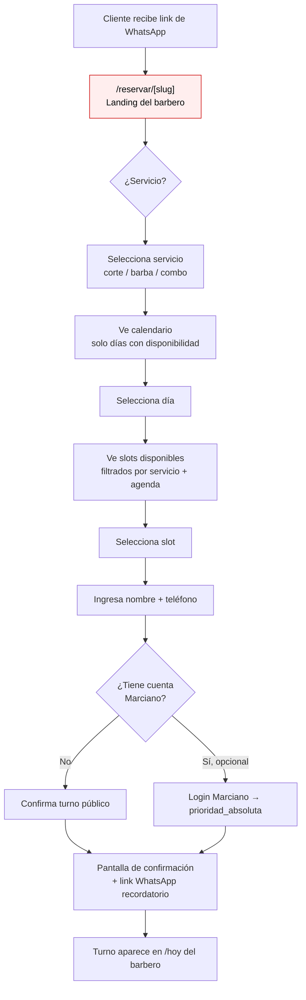
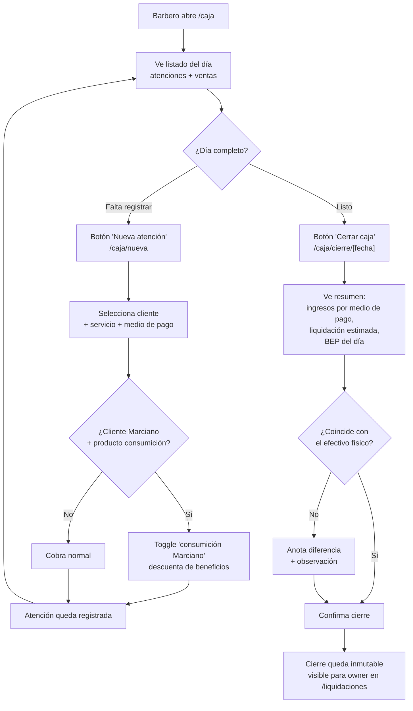
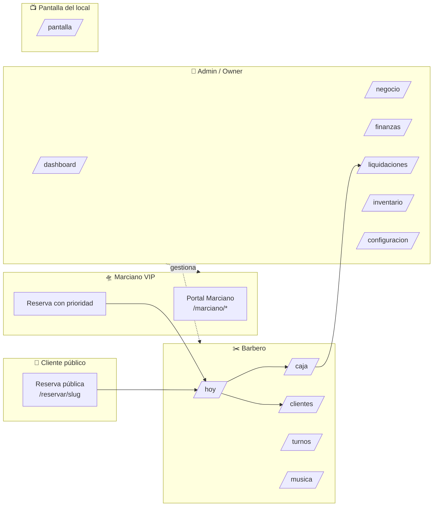

# A51 Barber — User Flows

Documento de referencia para el UI designer. Cubre las 4 personas y los 4 flows críticos del producto. Todos los diagramas están en Mermaid (renderiza nativo en GitHub, Notion, VS Code, y se puede pegar en Figjam con el plugin "Mermaid to Figjam").

---

## Personas

| Persona | Dispositivo principal | Acceso | Rutas que vive |
|---|---|---|---|
| **Admin / Owner** (Was) | Desktop + mobile | Login con rol `owner` | `/dashboard`, `/negocio`, `/finanzas`, `/liquidaciones`, `/inventario`, `/configuracion`, `/turnos` |
| **Barbero** | Mobile (en el local) | Login con rol `barbero` | `/hoy`, `/caja`, `/clientes`, `/turnos`, `/musica`, `/mi-progreso` |
| **Cliente público** | Mobile (link de WhatsApp) | Sin login | `/reservar/[slug]` |
| **Marciano VIP** | Mobile | Login con cuenta Marciano | `/marciano` (portal), `/marciano/turnos`, `/marciano/perfil`, `/marciano/ovnis`, `/marciano/ruleta` |

---

## Flow 1 — Reservar turno (Cliente público)

**Persona:** Cliente público sin cuenta.
**Entry point:** link de WhatsApp tipo `a51.app/reservar/{slug-del-barbero}`.
**Objetivo:** confirmar un turno en menos de 1 minuto.



**🔴 Gap conocido:** la página `/reservar/[slug]` tiene caracteres corruptos en el texto visible (bug de encoding). Es prioridad fix antes del handoff.
**🟡 Falta:** no hay flujo de reprogramación. Si el cliente quiere cambiar, hoy lo hace por WhatsApp manual.

---

## Flow 2 — Cierre de caja (Barbero)

**Persona:** Barbero al final del día.
**Entry point:** `/caja` desde bottom nav.
**Objetivo:** registrar ingresos del día, cerrar la caja y dejar evidencia para el owner.



**Detalle:** la lógica financiera vive en `src/lib/caja-finance.ts` y `src/lib/caja-atencion.ts`. El cierre es la fuente de verdad para liquidaciones — una vez confirmado no se edita.

---

## Flow 3 — Alta de Marciano (Admin → Cliente)

**Persona:** Owner/admin desde el detalle de un cliente existente.
**Entry point:** `/clientes/[id]`.
**Objetivo:** convertir un cliente regular en Marciano VIP.

```mermaid
flowchart TD
    A[Admin abre /clientes/[id]] --> B[Ve ficha del cliente]
    B --> C{¿Es Marciano?}
    C -->|No| D[Toggle 'Activar Marciano'<br/>toggleMarcianoAction]
    D --> E[Sistema actualiza<br/>marciano_activo = true]
    E --> F[Crea fila inicial en<br/>marciano_beneficios_uso<br/>cortes=0, consumiciones=0]
    F --> G[Cliente ahora puede:<br/>• Login en portal Marciano<br/>• Reservar con prioridad_absoluta<br/>• Recibir briefing pre-corte<br/>• Consumiciones del mes]
    G --> H[Admin envía credenciales<br/>por WhatsApp manual]

    C -->|Ya es Marciano| I[Toggle desactiva<br/>preservando historial]

    classDef gap fill:#fee,stroke:#c00,color:#000
    class H gap
```

**🟡 Gap:** el envío de credenciales al cliente es manual por WhatsApp. No hay onboarding automatizado para el cliente nuevo Marciano.

---

## Flow 4 — Briefing pre-corte (Barbero atiende Marciano)

**Persona:** Barbero en `/hoy` justo antes de atender un Marciano.
**Entry point:** turno con badge "Marciano" en `/hoy`.
**Objetivo:** que el barbero sepa con qué cliente se sienta (historial, preferencias, último corte) sin tener que pensar.

```mermaid
flowchart TD
    A[Barbero ve turno Marciano en /hoy] --> B[Tap en cliente]
    B --> C["/clientes/[id]"]
    C --> D{¿Es Marciano?}
    D -->|No| E[Ficha estándar<br/>sin briefing]
    D -->|Sí| F["Botón 'Generar briefing'"]
    F --> G[GET /api/clients/[id]/briefing]
    G --> H{¿Cache válida?}
    H -->|Sí| I[Devuelve briefing cacheado<br/>de client_briefing_cache]
    H -->|No| J{¿Hay historial?}
    J -->|No| K[Fallback: briefing de primer corte]
    J -->|Sí| L[Llama a Claude API<br/>con historial + preferencias]
    L --> M[Genera briefing<br/>tono Pinky, máx 2 párrafos]
    M --> N[Guarda en cache]
    K --> N
    I --> O[Barbero lee briefing<br/>antes de empezar el corte]
    N --> O
    O --> P[Atiende → /caja/nueva]
```

**Detalle:** el briefing solo está disponible para Marcianos (403 si no). Cache key por `viewerScope + viewerBarberoId` — distintos barberos pueden tener briefings personalizados. Vive en `src/app/api/clients/[id]/briefing/route.ts`.

---

## Mapa de superficies × personas



---

## Cómo usar este doc con el designer

1. **Empezá por las personas** — definí en qué dispositivo y contexto está cada una.
2. **Recorré los 4 flows en orden de prioridad UX:**
   - Reservar (es la cara pública del producto)
   - Briefing (es la magia del producto — diferencial competitivo)
   - Cierre de caja (es el momento de mayor fricción operativa)
   - Alta de Marciano (es donde se decide el funnel VIP)
3. **Los nodos en rojo son gaps reales** — no son crítica de diseño, son trabajo pendiente.
4. **El mapa de superficies × personas** sirve para discutir jerarquía: qué tiene que ser obvio para cada quién.
